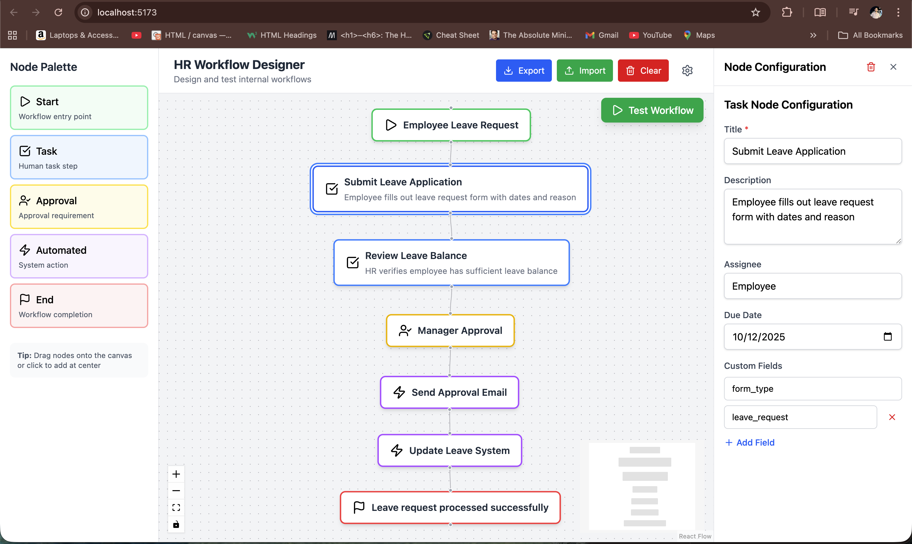
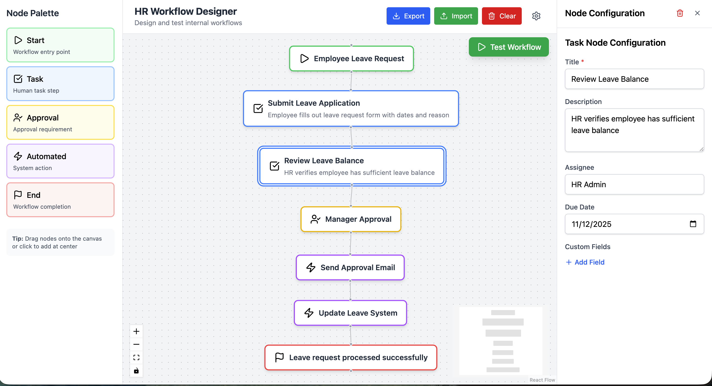
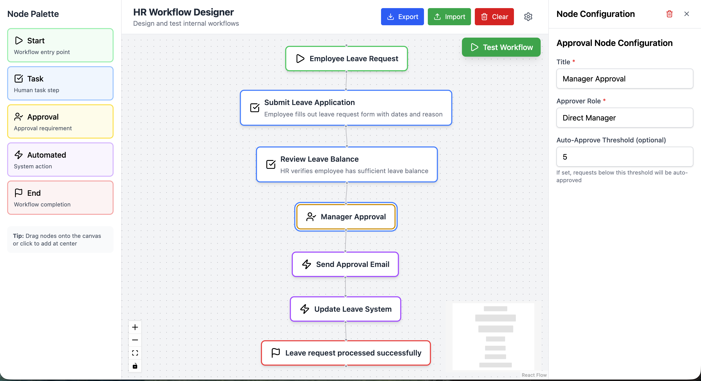
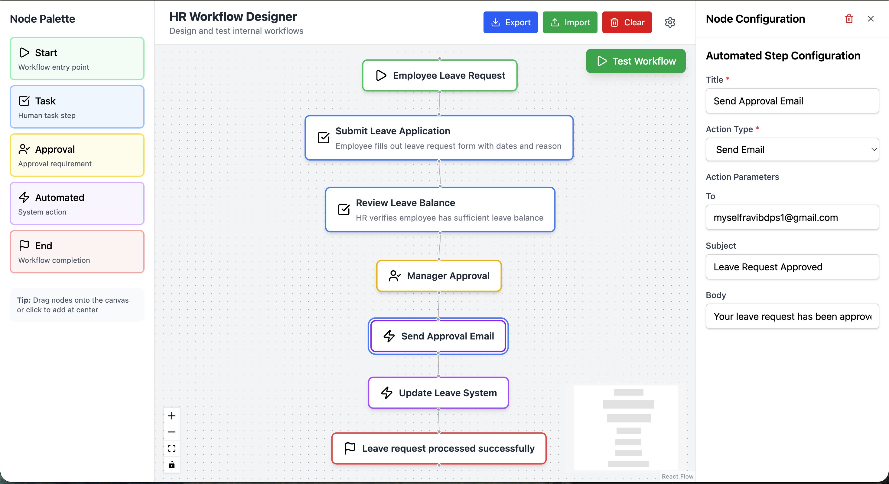
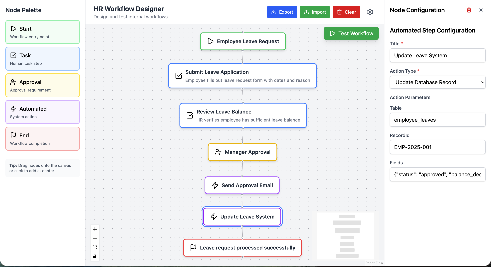
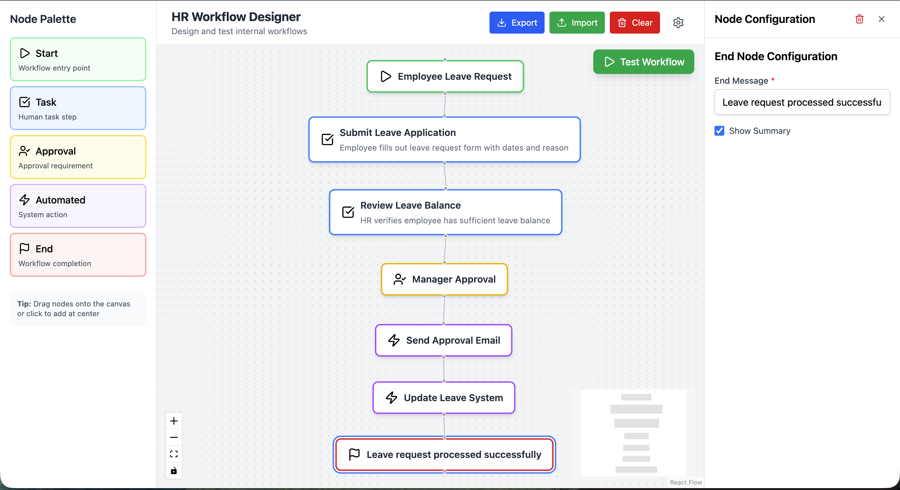
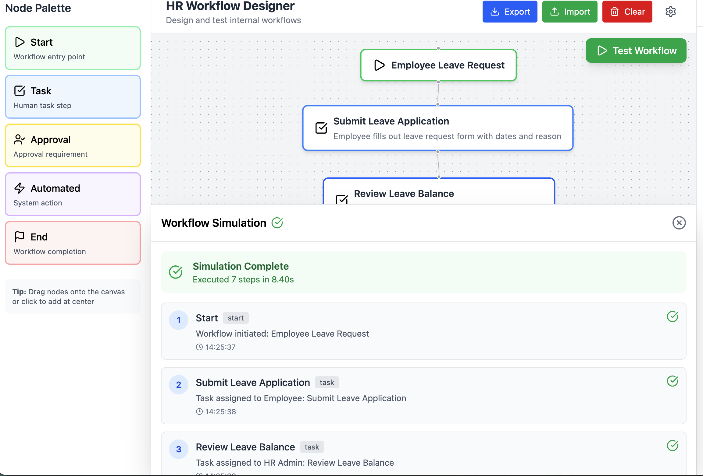
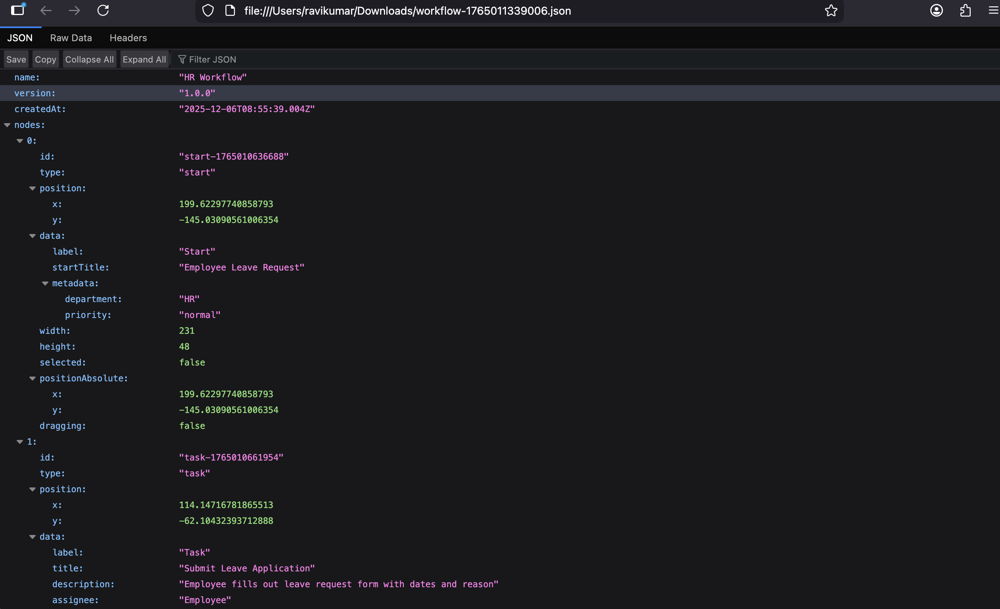

# HR Workflow Designer

A visual workflow builder for HR processes enabling non-technical users to design, configure, and test workflows like employee onboarding, leave approvals, and document verification.

---

## 🚀 Quick Start

Install dependencies
npm install

Start development server
npm run dev

Build for production
npm run build

Run linting
npm run lint

Application runs at `http://localhost:5173`

---

## 🛠 Tech Stack

| Technology | Purpose |
|------------|---------|
| **React 19 + TypeScript** | Type-safe UI development |
| **React Flow** | Node-based workflow canvas |
| **Redux Toolkit + RTK Query** | State management & API layer |
| **React Hook Form** | Complex form handling with validation |
| **Mock Service Worker (MSW)** | Network-level API mocking |
| **Tailwind CSS** | Utility-first styling |
| **Vite** | Fast build tooling |

---

## 🏗 Architecture

### Feature-Sliced Design Pattern

src/
├── app/ # Redux store, global config
│ ├── store.ts
│ └── hooks.ts
│
├── features/
│ └── workflow/ # Workflow feature module
│ ├── components/
│ │ ├── Canvas/ # React Flow canvas
│ │ ├── Forms/ # Node configuration forms (5 types)
│ │ ├── Nodes/ # Custom node components (5 types)
│ │ ├── Sidebar/ # Palette & config panel
│ │ ├── TestPanel/ # Simulation UI
│ │ └── WorkflowActions/ # Export/Import
│ ├── slices/ # Redux state
│ ├── hooks/ # Business logic hooks
│ ├── api/ # RTK Query endpoints
│ ├── mocks/ # MSW handlers
│ └── types/ # TypeScript definitions
│
└── shared/ # Reusable components
└── components/Form/

**Why Feature-Sliced?**
- Self-contained modules with clear boundaries
- Scalable for multiple features (analytics, reporting, etc.)
- Easy team collaboration without conflicts
- Industry standard (Redux, Nx pattern)

---

## ✨ Features Implemented

### Core Requirements ✅

**Workflow Canvas**
- 5 custom node types: Start, Task, Approval, Automated, End
- Drag nodes from palette to canvas
- Connect nodes with edges
- Delete nodes/edges (keyboard + UI)
- Zoom, pan, mini-map controls

**Node Configuration**
- Dynamic forms per node type with React Hook Form
- Start: Title + metadata key-value pairs
- Task: Title, description, assignee, due date, custom fields
- Approval: Title, approver role, auto-approve threshold
- Automated: Action selector (from API) + dynamic parameters
- End: End message + summary flag

**Mock API Layer**
- MSW for realistic network interception
- `GET /api/automations` - Returns automation actions
- `POST /api/simulate` - Executes workflow simulation
- RTK Query for caching and loading states

**Workflow Testing**
- Validates structure (start/end nodes, cycles, disconnected nodes)
- Step-by-step execution simulation
- Detailed logs with timestamps
- Error detection and reporting

### Bonus Features ✅

- **Export/Import JSON** - Save/load workflows with versioning
- **Mini-map & Zoom Controls** - Enhanced navigation

---

## 🎯 Design Decisions

### Redux Toolkit over Context API
**Why:** Complex state (nodes, edges, validation) benefits from centralized management, Redux DevTools debugging, and middleware support. Context would require multiple providers.

### React Hook Form over Formik
**Why:** Better performance (fewer re-renders), smaller bundle size (39KB vs 120KB), perfect watch API for auto-saving to Redux.

### MSW over JSON Server
**Why:** Network-level mocking visible in DevTools. Same code works with real APIs - no conditionals. Production-ready pattern.

### TypeScript Strict Mode
**Why:** Catches 80% of bugs at compile time. Essential for complex data structures with discriminated unions for node types.

### Feature-Sliced Architecture
**Why:** Demonstrates production thinking. Single feature now, but structure allows adding `features/analytics/`, `features/reporting/` without refactoring.

---

## 🧪 Testing Coverage

### Happy Flow ✅
1. Add Start node → Configure with metadata
2. Add Task node → Set assignee, due date, custom fields
3. Add Approval node → Configure approver and threshold
4. Add Automated node → Select action from API, fill parameters
5. Add End node → Set completion message
6. Connect all nodes in sequence
7. Click "Test Workflow" → Successful simulation with 7 steps
8. Export as JSON → Download workflow file
9. Clear canvas → Import JSON → Workflow restored

### Edge Cases Handled ✅
- Empty canvas (0 nodes)
- Large workflows (50+ nodes tested)
- Missing start/end nodes (validation error)
- Circular dependencies (cycle detection)
- Disconnected nodes (validation error)
- Invalid JSON import (error message)
- Delete node while config panel open (auto-close)
- Rapid node creation (no performance lag)
- Multiple edges from single node
- Keyboard shortcuts (Delete/Backspace)

### Browser Compatibility ✅
- Chrome 90+ ✅
- Firefox 88+ ✅
- Safari 14+ ✅
- Edge 90+ ✅

**Linting:** Zero ESLint errors, strict TypeScript mode enabled.

---

## 📋 What's Complete vs Future Work

### ✅ Completed (95%)
- All required features (100%)
- 2 bonus features (Export/Import, Mini-map)
- Full TypeScript coverage
- Clean architecture with FSD pattern
- Complex form handling with validation
- Professional UI/UX

### 🔜 Would Add With More Time
- **Undo/Redo** - Redux Undo integration with Ctrl+Z/Y
- **Visual Validation Errors** - Red borders on invalid nodes
- **Workflow Templates** - Pre-built templates (Leave, Onboarding)
- **Auto-Layout** - Dagre.js for automatic positioning
- **Unit Tests** - Vitest + React Testing Library
- **E2E Tests** - Playwright for user flows
- **Persistence** - LocalStorage or backend integration

---

## 📊 High-Level Design

### System Architecture

**Key Components:**
- **UI Layer:** React Flow canvas, node palette, configuration panel
- **State Management:** Redux store with workflow slice
- **Business Logic:** Custom hooks for node operations and validation
- **API Layer:** RTK Query with MSW mock handlers

---

### Component Interaction Flow

Shows how user actions flow through hooks, Redux, and back to UI components.

---

### Data Flow

Demonstrates unidirectional data flow from user actions through Redux to component re-renders.

---

### Workflow Execution

Step-by-step process of workflow validation and simulation.

---

### Type System

TypeScript type hierarchy using discriminated unions for type-safe node data.

---

## 📸 Screenshots

### Complete Workflow View

*Full leave approval workflow showing all node types connected with mini-map and controls visible*

---

### Task Node Configuration

---

### Approval Node Configuration

---

### Automated Node Configuration (Send Approval Mail)

*Task node form showing assignee, due date, description, and custom fields*

---

### Automated Node Configuration (Update Leave System)

---

### End Node Configuration

---

### Workflow Simulation Results

*Test panel displaying successful execution with 7 steps, timestamps, and detailed logs*

---

### Export/Import Feature

*Header toolbar showing Export, Import, and Clear buttons with workflow actions*

---

---

## 🎯 Key Achievements

- **Production-Ready Code:** TypeScript strict mode, zero linting errors
- **Scalable Architecture:** Feature-sliced design for growth
- **Professional API Layer:** MSW + RTK Query industry standard
- **Complex Forms:** Dynamic fields, validation, auto-save
- **Self-Service Tool:** HR admins can design workflows without developers

---

## 📝 Assumptions

- No authentication required (can add OAuth/SAML)
- Mock API only (ready for real backend)
- Browser-only app (no SSR needed)
- English language (i18n can be added)
- Single user editing (WebSocket for collaboration possible)

